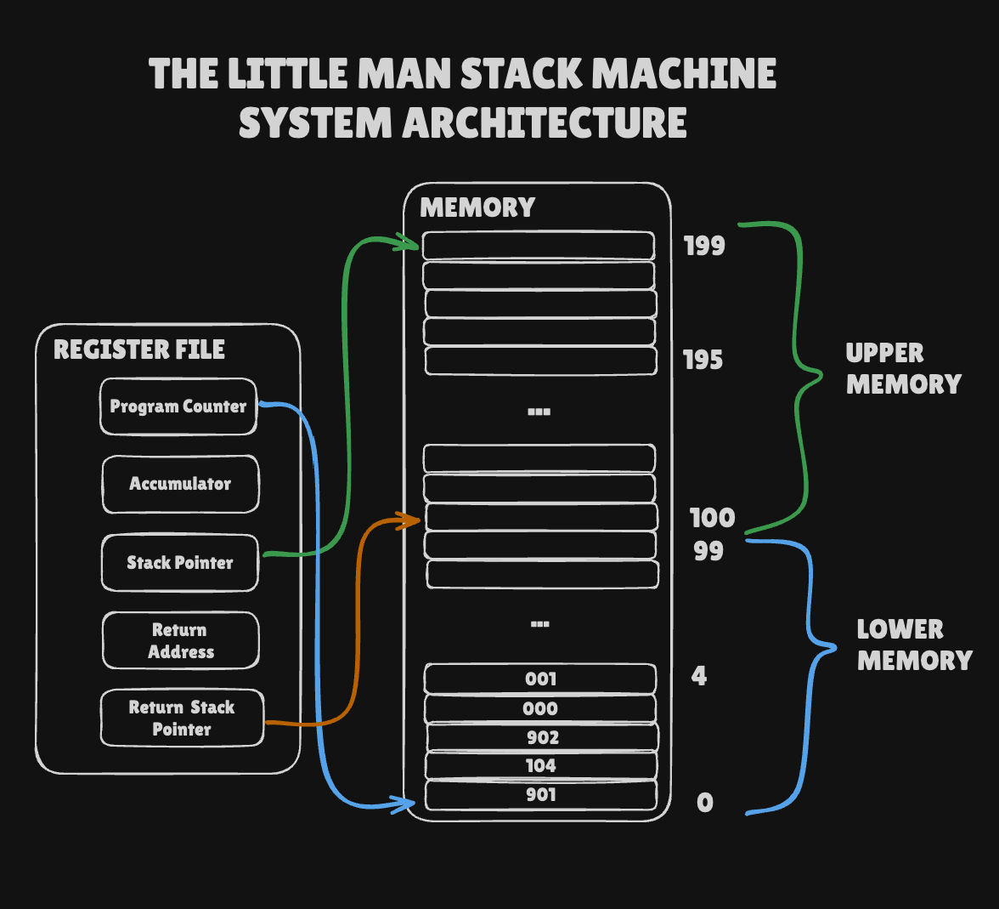

# Little Man Stack Machine

The year is 1970, and, for the last five years, the [Little Man Computer](https://en.wikipedia.org/wiki/Little_man_computer)
has been the dominant system in the burgeoning computer revolution.  The chip that the computer uses, the [x80 Trix](https://en.wikipedia.org/wiki/X86),
produced by [Mintel](https://en.wikipedia.org/wiki/Intel), however, is starting to show its age.  Worse, a competitor, [United Fruit Computing](https://en.wikipedia.org/wiki/Apple_Inc.), has just
released a new chip, the [eM-Uno](https://en.wikipedia.org/wiki/Apple_M1), which puts Mintel's Little Man Computer industry dominance at risk.

Mintel has decided to create a new, more advanced chip, the [hAPY-243](https://en.wikipedia.org/wiki/Intel_iAPX_432), which:

* Supports a much larger set of instructions
* Supports more memory
* Includes support for the concept of a stack

This new, advanced architecture will allow LMC programmers to write much more compact code and even use a new-fangled
technology called "function calls".

This new chip will support a machine called The Little Man Stack Machine(tm): A Revolution in Little Man Computing(c).

The only problem is, Mintel is having a tough time actually producing the chip.  They announced it last year in a bit
of a panic due to the em-Uno, but so far no one has seen this new chip.

Mintel needs help, and fast.

## The LMSM Achitecture

The LMSM architecture is backwards compatible with the LMC.  All instructions that work on LMC will work on LMSM:

| code | assembly  | asm_instruction    | description                                                                                  |
|------|-----------|--------------------|----------------------------------------------------------------------------------------------|
| 1xx  | ADD xx    | Add                | Add the value stored in location xx to the current value in the accumulator                  |
| 2xx  | SUB xx    | Subtract           | Subtract the value stored in location xx to the current value in the accumulator             |
| 3xx  | STA xx    | Store              | Store the value in the accumulator to the location xx                                        |
| 5xx  | LDA xx    | Load               | Load the value from location xx into the accumulator                                         |
| 6xx  | BRA xx    | Branch             | Unconditionally branch to the asm_instruction at the location xx                             |
| 7xx  | BRZ xx    | Branch if zero     | Branch to the asm_instruction at the location xx if the accumulators value is zero           |
| 8xx  | BRP xx    | Branch if positive | Branch to the asm_instruction at the location xx if the accumulators value is positive       |
| 901  | INP       | Input              | Get numeric input from the user                                                              |
| 902  | OUT       | Output             | Print the current value of the accumulator                                                   |
| 000  | HALT, COB | Halt               | Stop the computer                                                                            |
|      | *DAT*     | Data               | Assembler asm_instruction to simply write the raw value following this declaration to memory |

As with the LMC, LMSM assembly may use labels to reference particular parts of memory.

Any valid LMC program should also be a valid LMSM program.

In addition to these standard LMC instructions, a new asm_instruction has been added to the standard set:

| code | assembly | asm_instruction | description                                      |
|------|----------|-----------------|--------------------------------------------------|
| 4xx  | LDI xx   | Load Immediate  | Loads the value xx into the accumulator directly |

This asm_instruction allows programs to load a value "immediately" into the accumulator.

### Capped Values

As with the original Little Man Computer, the values stored in memory locations and in the accumulator should be capped
between -999 and 999.

### The LMSM Accumulator

The biggest difference between the x80 Trix and the hAPY 243, is that the hAPY 243 chip has double the memory of the
x80 Trix.  However, old instructions cannot address the upper part of memory due to the fact that LMC machine code only
allows for references from 0-99.

Instead of acting like raw memory, the upper 100 slots of memory in the LMSM provide support for a _stack_.  The new
machine has three new registers:

* `stack_pointer` - points to top value on the stack
* `return_address` - the current return address
* `return_stack_pointer` - points to top of the saved return address stack

The stack in the LMSM starts at the *TOP* of memory (position 199) and grows *DOWN*, where the return stack starts
at the memory location 100 and grows *UP*.

Here is a schema of the LMSM architecture:



#### Stack Instructions

To work with these new registers and this new memory, the LMSM provides a series of stack-based instructions:

| code | assembly | asm_instruction              | description                                                                                                              |
|------|----------|------------------------------|--------------------------------------------------------------------------------------------------------------------------|
| 920  | SPUSH    | Stack push                   | Pushes the current value of the accumulator onto the top of the stack                                                    |
| 921  | SPOP     | Stack pop                    | Pops the current value off the stack into the accumulator                                                                |
| 922  | SDUP     | Stack duplicate              | Duplicates the current value on the top of the stack                                                                     |
| 923  | SDROP    | Stack drop                   | Drops the top value from the stack                                                                                       |
| 924  | SSWAP    | Stack swap                   | Swaps the top two values on the stack                                                                                    |
| 930  | SADD     | Stack add                    | Pops the top two values on the stack, adds them and pushes the result onto the stack                                     |
| 931  | SSUB     | Stack subtract               | Pops the top and second values on the stack, subtracts the top from the second, and pushes the result onto the stack     |
| 932  | SMUL     | Stack multiply               | Pops the top two values of the stack,  multiplies them and pushes the result onto the stack                              |
| 933  | SDIV     | Stack divide                 | Pops the top and second values on the stack, divides second value by the top value, and pushes the result onto the stack |
| 934  | SMAX     | Stack maximum                | Pops the top two values of the stack and pushes the maximum value of the two back onto the stack                         |
| 935  | SMIN     | Stack minimum                | Pops the top two values of the stack and pushes the minimum value of the two back onto the stack                         |
| 937  | SCPMGT   | Stack compare (greater than) | Pops the top two values of the stack and 1 if the second value is greater than the top value, 0 otherwise                |
| 938  | SCPMLT   | Stack compare (less than)    | Pops the top two values of the stack and 1 if the second value is less than the top value, 0 otherwise                   |
| 939  | SNOT     | Stack not                    | Pops the top value of the stack, pushes 1 if the value is 0 and pushes 0 otherwise                                       |

The stack can also be adjusted and written to and read from with the following instructions:

> [!WARNING]
> The opcodes of these instructions are somewhat misleading. Because zero is not a signable integer, we cannot use it as the first value for an imaginary `-0xx` set. Instead we have to use the upper bound as the inclusive limit. This means that, for example, the `-1xx` instruction range is actually the set of numbers `-001 to -100` where `-001` corresponds to the value `0`. A negative instruction can be mapped to it's value by subtracting the first value in it's set and negating the result: `-(-003 - -001) = 2`. Here `-001` is the first value in the `-1xx` set so we have the result `opval = -(opcode - -001)`

| code | assembly | asm_instruction        | description                                                                                                     |
|------|----------|------------------------|-----------------------------------------------------------------------------------------------------------------|
| -1XX | SPADD    | Stack pointer add      | Adds 1 + XX to the current stack pointer                                                                            |
| -2XX | SPSUB    | Stack pointer subtract | Subtracts 1 + XX from the current stack pointer                                                                     |
| -3XX | SLDA     | Stack load             | Copies the value at XX'th slot down the stack and pushes it onto the top of the stack.                          |
| -4XX | ..       | ..                     | Reserved for future use                                                                                         |
| -5XX | STA      | Stack store            | Pops the top value off of the stack and **then** sets the XX'th slow down the stack to that value              |

##### Synthetic Instruction

In addition to these instructions, the following synthetic instruction is available:

| code | assembly    | asm_instruction      | description                                   |
|------|-------------|----------------------|-----------------------------------------------|
|      | *SPUSHI xx* | Stack push immediate | Pushes the value xx onto the top of the stack |

This asm_instruction will compile down to the following to actual instructions in the following manner:

```
00:  SPUSHI 22
```

becomes

```
00:  LDI 22
01:  SPUSH
```

The assembler will need to take this two-slot asm_instruction into account when creating machine code.

Note this command is pronounced in such a way that it rhymes with "Sushi"

#### Function Call Instructions

In addition to these raw instructions for working with the stack, Mintel also has introduced the notion of a "function call".
These so-called "function calls" are an abstraction that allow programmers to work at a higher level of abstraction than
normal assembly does.

| code | assembly | asm_instruction | description                                                                                                        |
|------|----------|-----------------|--------------------------------------------------------------------------------------------------------------------|
| 910  | JAL      | Jump & Link     | Jumps to the function address in the accumulator, saving next instruction address in the `return_address` register |
| 911  | RET      | Return          | Sets the program counter to the value found int the return address register                                        |
| 925  | RPUSH    | Return push     | Pushes the current value in the return address register onto the return address stack                              |
| 926  | RPOP     | Return pop      | Pops the top value off the return address stack into the return address register                                   |

Using these instructions, LMSM implements the following calling convention:

* Before making a call, a caller must save the current return address register value by pushing it onto the return address stack usgint the `RPUSH` instruction
* A function is called by jump-and-linking `JAL` to it.  All arguments are on the stack.
* When the callee function is complete it should leave its value on the top of the stack, with all arguments consumed
* The callee uses the `RET` instruction to return execution to the caller
* The caller restores the original return address with the `RPOP` instruction

##### Function Call Example

Consider an example where we wish to call a function located at position 50 that returns the maximum value of two
parameters passed to it with two arguments, 1 and 2.

We would have the following LMSM machine code:

```
00: 401       # LDI 1  - load the constant 1
01: 920       # SPUSH  - push the value onto the stack as argument 1
02: 402       # LDI 2  - load the constant 2
03: 920       # SPUSH  - push the value onto the stack as argument 2
04: 450       # LDI 50 - load the constant 50
05: 925       # RPUSH  - save the current return address to the return address stack
06: 910       # JAL    - call the function, consuming the 50 and setting the return_address register to 07
07: 926       # RPOP   - restore the original return address
08: ...       # this code can assume the return value of the function is on the top of the stack
...
50: 925       # SMAX   - compute the max of the two arguments and leave on the top of the stack
51: 911       # RET    - jumps back to the address currently stored in return_address and pops the return_address from under the return value
```

##### The`CALL` Assembly Pseudo-Instruction

In order to make assembly programming on the LMSM more enjoyable, the `CALL` pseudo-instruction is supported.

| code | assembly  | asm_instruction | description                            |
|------|-----------|-----------------|----------------------------------------|
|      | *CALL xx* | Call            | Calls a function at memory location xx |


The `CALL` pseudo-instruction takes an argument, the address of the function to call.  The `CALL` pseudo-instruction
then "compiles" down to three instructions:

* An `LDI` that loads the address of the function to call into the
  accumulator
* A `JAL` that jump-and-links to it.

As an example, consider the following assembly:

```
...
10: CALL FOO
...
32: FOO DUP
33: RET
...
```

Here we have a `CALL` instruction targeting the method declared with the label `FOO`.  Let's assume that `FOO` ends
up at position 32 in memory.  In that case, the `CALL FOO` assembly pseudo-instruction will assemble down to the
following machine instructions:

```
LDI 32    // load the constant 32 into the accumulator
JAL       // issue a JAL instruction, which will jump-and-link to it
```

## High Level Languages

In addition to this new exciting hardware, Mintel is interested in producing "high level languages" for their new chip.

They expect that most programmers will continue to use assembly to program their chips, but that a few academic institutions
might be interested in experimenting with such futuristic languages.

They intend to produce three different languages for their new system:

* Zortran - for scientific computing
* Sea - for systems programming
* Firth - not sure, but a crazy guy keeps insisting on it

### Zortran

Zortran is a practical programming language for scientific computing.  

It has no function call support, but supports things like variables and loops and so forth.

Here is a basic Zortran program:

```fortran
factor = READ
scaler = READ
result = 0
DO WHILE scaler - 1 >= 0
    result = result + factor
    scaler = scaler - 1
END
WRITE result
```

You will need to assist in helping build this language.

### Sea

Sea is a programming language designed for "systems programming", whatever that is.  It supports function calls and
looks like this:

```c
int main() {
    for (int x = 0; x < 3; x = x + 1) {
        putn(x);
    }
    return 0;
}
```

### Firth

Mintel has an employee who appears to be a bit crazy, but who claims he has developed a high level language for the new
platform, with a nearly-complete compiler.  He calls this new language "Firth" and, to be frank, the language looks a
little insane, although not as insane as the inventor himself.

Firth is a stack-based language that uses Reverse Polish Notation and some strange syntax.

Here are the basic components of the language:

```
1                             // number literals, which push the given value on to the stack

1 2 +                        // math ops, which are post-fix, RPN style.  This example pushes 1, then 2 onto the stack then adds them

get                          // this gets an integer from the user and places it on the stack

dup                          // duplicates the top of the stack

drop                         // drops the top of the stack

.                            // this prints the current element on the top of the stack

var x                        // declares a variable named `x` with the value 0

10 x!                        // this sets the global variable `x` to the value 10

foo()                        // invoke the function foo (with the preceding arguments, if any)

zero?                        // a conditional thingie, if the top of the stack is non-zero the first
  <expressions>              // expressions are executed, otherwise the second are executed
else                         // note that the else is optional
  <expressions>
end

def foo                      // a function definition, note there are no parameters: parameters
  <expressions>              // are implicitly passed on the stack
end
```

Here is a basic firth program to ask the user for a number and then square it:

```
get       -- get a number from the user and place it on the stack
dup       -- duplicate the top of the stack 
*         -- multiply the two copies together
.         -- print it out
```

This could be written as a single line of firth:

```
get dup * .
```

Which the crazy old guy says is awesome and way better than dealing with assembly, but then he trails off and starts
muttering about the OSI, the Kennedy brothers and some sort of "coup", so who knows what to believe?

## Gallatin Computing Inc.

Your company, Gallatin Computing Inc., has been chosen by Mintel to write an *emulator* for the new LMSM chip.  Your
emulator will be used by developers who want to write programs for the new LMSM architecture before it is generally
available in silicon.

The emulator will have the following functionality:

* The ability to assemble the high level LMSM instructions into LMSM machine code
    * including label support
* The ability to load LMSM programs into an emulated system
* The ability to run and/or step through the execution of a program
* The ability to inspect the state of the system
* The ability to execute instructions directly
* The ability to manipulate the system directly
* The ability to compile Firth to memory and execute it

You have been provided with a test suite to assist you in your quest.

Good luck!
